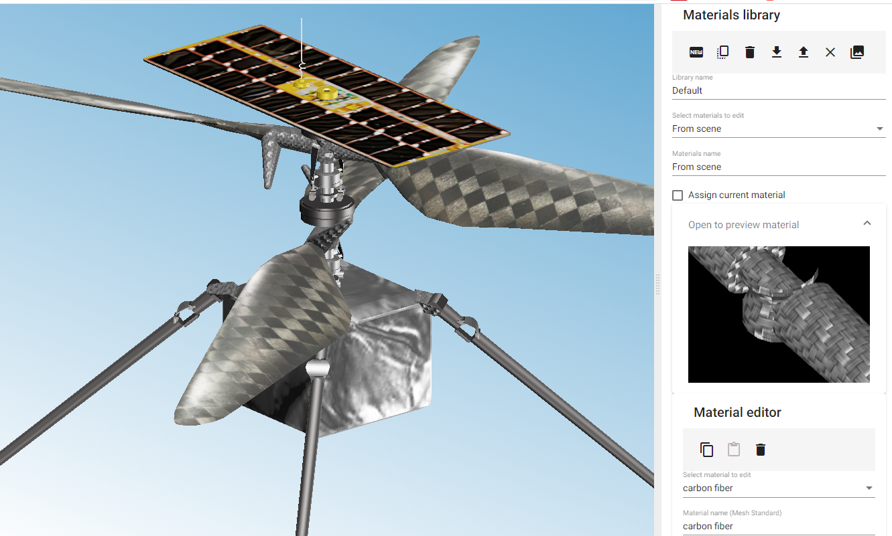

# SceneEditor

*ThreeJS scene editor.*  
ThreeJS has a [Scene Editor](https://threejs.org/editor/), but this editor is JavaScript based and difficult to extend. This project is to create Angular based alternative.

[Edit on StackBlitz ⚡️](https://stackblitz.com/github/VJigouline/SceneEditor)  
[Angular documentation](https://angular.io/docs)

This project was generated with [Angular CLI](https://github.com/angular/angular-cli) version 8.3.8.  
Project options: routing and [SCSS](https://sass-lang.com/documentation) as a style sheet.

## Version 1.0 released

Stable version 1.0 released. It covers significant part of editing for ThreeJS lights and materials. Viewing GLTF, Collada and STL files. Editing lights and materials for imported files. Retrieving materials from the loaded GLTF and Collada files. Saving and loading lights and materials to reuse in other projects. Exporting scene in GLTF format.

## Release builds
Release build can be found on main branch in the builds\Releases folder.
### Installation
Unzip release build archive into folder on the web server and call index.html file. Due to security limitations of the web browsers the build can be run only from the web server. Running build from the local computer will cause script loading failures.

## Further development
Implementation of constructive geometry creation and editing.

## Usage
Working version at [scene.meercad.com](http://scene.meercad.com)

Partial help is available at [help.meercad.com](https://help.meercad.com). This is a work in progress.

This project is not finished. Detailed documentation will be added later.
It is possible right now to drop GLTF/GLB (file or folder), STL or saved three.js scene file into graphics area on the left and try using controls. 

_The image is made from the GLTF model loaded into **SceneEditor**. The model can be found on [NASA Ingenuity page](https://mars.nasa.gov/resources/25043/mars-ingenuity-helicopter-3d-model/?site=insight). After loading model will look dark due to darker materials. Lights intensity should be increased in the **Light Editor**_

## Additional modules

These modules should be added on top of the standard angular installation (`npm install` should do it for you)

### Dependencies

`npm install angular-split` [Documentation](https://bertrandg.github.io/angular-split/#/documentation)  
`npm install three` [Documentation](https://threejs.org/docs/#manual/en/introduction/Import-via-modules)  
`npm install angular-resize-event` [Documentation](https://www.npmjs.com/package/angular-resize-event)  
`ng add @angular/material` [Documentation](https://material.angular.io/guide/getting-started), accept _HammerJS_ option for the jesture recognition, accept browser animations.  
`npm install file-saver` [Documentation](https://www.npmjs.com/package/file-saver)  
`npm install ngx-color-picker` [Documentation](https://www.npmjs.com/package/ngx-color-picker)  
`npm install angular-in-memory-web-api` [Documentation](https://angular.io/tutorial/toh-pt6) - web server simulation for the testing  
`npm install uuid` [Documentation](https://www.npmjs.com/package/uuid)  
`npm install ngx-file-drop` [Documentation](https://www.npmjs.com/package/ngx-file-drop)  
`npm install --save-dev @types/three` [Documentation](https://github.com/DefinitelyTyped/DefinitelyTyped)  
`npm install ngx-spinner --save` [Documentation](https://www.npmjs.com/package/ngx-spinner) - loading spinner.

## Development server

Run `ng serve` for a dev server. Navigate to `http://localhost:4200/`. The app will automatically reload if you change any of the source files.

## Code scaffolding

Run `ng generate component component-name` to generate a new component. You can also use `ng generate directive|pipe|service|class|guard|interface|enum|module`.

## Build

Run `ng build` to build the project. The build artifacts will be stored in the `dist/` directory. Use the `--prod` flag for a production build.

## Running unit tests

Run `ng test` to execute the unit tests via [Karma](https://karma-runner.github.io).

## Running end-to-end tests

Run `ng e2e` to execute the end-to-end tests via [Protractor](http://www.protractortest.org/).

## Further help

To get more help on the Angular CLI use `ng help` or go check out the [Angular CLI README](https://github.com/angular/angular-cli/blob/master/README.md).
